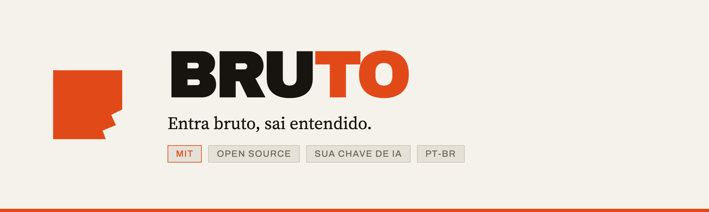

<picture>
  <source media="(prefers-color-scheme: dark)" srcset="assets/banner-escuro.png">
  
</picture>

<p align="center">
  <a href="#instala%C3%A7%C3%A3o"><b>Instalar</b></a> ·
  <a href="#extens%C3%A3o-de-navegador"><b>Extensão</b></a> ·
  <a href="ROADMAP.md"><b>Roadmap</b></a> ·
  <a href="CONTRIBUTING.md"><b>Contribuir</b></a>
</p>

<p align="center">
  
  
  
  
</p>

---

Cole o link de um vídeo — **YouTube, Instagram ou TikTok** — e receba **resumo**, **transcrição**, **mapa mental** e uma **aula completa** em português: objetivos, conceitos explicados do zero, glossário e teste de fixação. Exporta `.docx` e `.pdf`.

Roda na sua máquina, com a sua chave de IA. Sem assinatura, sem limite, sem lock-in.

> **Não resume. Ensina.**
> As dezenas de extensões que resumem vídeo devolvem cinco bullets e um paywall. O Bruto entrega uma **aula**: o que você deveria saber ao final, cada conceito explicado desde o começo, um glossário dos termos que o autor assumiu que você conhecia, e um teste para descobrir se entendeu mesmo.

---

## Por que ele existe

Ele funciona onde os outros não vão: **Instagram e TikTok**. A maioria só faz YouTube porque depende de legenda pronta. Vídeo curto raramente tem — então o Bruto transcreve o áudio. (Verificado em 10/09/2026 com um reel real: metadados, Whisper, resumo, mapa mental e os exports, tudo de ponta a ponta.)

## Como funciona

1. `yt-dlp` busca metadados e legendas no idioma original, **sem baixar o vídeo**. Se não houver legenda, baixa só o áudio e transcreve com Whisper local.
2. Um modelo de linguagem gera resumo, mapa mental e classifica a categoria — tudo em PT-BR.
3. Vídeo em outro idioma pode ser traduzido por inteiro.
4. **Estudar** (sob demanda) monta a aula didática.
5. Exports em `.docx` e `.pdf`, com o mapa mental renderizado como imagem.
6. Catálogo em SQLite; arquivos em `~/.bruto/library/<id>/`.

Tudo local. Nenhum dado seu passa por servidor nosso — não existe servidor nosso.

## Instalação

```bash
git clone https://github.com/Ideia-Business/bruto.git
cd bruto

brew install yt-dlp                 # obrigatório
uv tool install mlx-whisper         # opcional — vídeos sem legenda (ver abaixo)
npm install
npx playwright install chromium     # exports .pdf + imagem do mapa
npm run db:push && npm run db:seed
npm run doctor                      # confere as dependências
```

### Vídeo sem legenda — o transcritor

Instagram e TikTok quase nunca publicam legenda, e é para esses que o Bruto baixa o áudio e
transcreve na sua máquina. Serve **qualquer um** destes três — o Bruto detecta sozinho, nesta
ordem, e usa o primeiro que encontrar:

| Transcritor | Instalação | Observação |
|---|---|---|
| **mlx-whisper** | `uv tool install mlx-whisper` | o mais rápido em Apple Silicon |
| **whisper** (CLI da OpenAI) | `pip install -U openai-whisper` | roda em qualquer plataforma |
| **whisper.cpp** | `brew install whisper-cpp` | precisa também de um modelo `ggml-base.bin` no disco |

Nenhum deles instalado? O app segue funcionando para vídeo **com** legenda publicada; o que sem
legenda faz é falhar dizendo exatamente isto, em vez de devolver resumo vazio.

`npm run doctor` mostra qual foi detectado. Para trocar o modelo: `BRUTO_WHISPER_MODEL=small`.

### O modelo de linguagem — a sua chave, o seu custo

O Bruto precisa de um modelo para resumir. **Você escolhe qual, e a chave é sua.** Copie o exemplo e preencha **uma** linha:

```bash
cp .env.example .env
```

| Provedor | Variável | Onde pegar |
|---|---|---|
| Anthropic | `ANTHROPIC_API_KEY` | console.anthropic.com |
| OpenAI | `OPENAI_API_KEY` | platform.openai.com |
| OpenRouter | `OPENROUTER_API_KEY` | openrouter.ai — um cadastro, centenas de modelos |
| Ollama Cloud | `OLLAMA_API_KEY` | ollama.com — modelos abertos, hospedados |
| Google Gemini | `GOOGLE_API_KEY` | aistudio.google.com |
| Claude Code CLI | *nenhuma* | já autenticado na sua máquina |

Se você **já usa o Claude Code**, não precisa de chave nenhuma: o Bruto detecta o CLI e usa sua sessão. É o caminho de zero configuração.

A chave fica no seu `.env`, que está no `.gitignore`. Ela nunca sai da sua máquina, nunca vai para o repositório e nunca aparece em mensagem de erro — o texto de erro dos provedores é descartado no transporte, e só o código de status atravessa.

**Modelo:** o Bruto pede um *tier* (`fast` para classificar, `balanced` para resumo, mapa, aula e tradução) e cada provedor traduz para um modelo seu. Sobrescreva com `BRUTO_MODEL_BALANCED` se quiser outro — recomendado no OpenRouter e no Ollama Cloud, cujos catálogos são grandes e mudam com frequência.

`npm run doctor` mostra o estado de todos os provedores e diz qual está ativo.

## Uso

```bash
npm run dev            # http://localhost:3000
npm run app            # sobe produção e abre em janela de app (macOS)

# ou sem interface:
npm run process -- "https://www.youtube.com/watch?v=<id>" [--whisper] [--traduzir]
```

## Extensão de navegador

Resume o vídeo que você **já está assistindo**, sem sair da aba. Ela lê a legenda da página e chama o modelo com a sua chave — não baixa mídia nenhuma.

```bash
npm run build:ext
```

Depois, no Chrome: `chrome://extensions` → **Modo do desenvolvedor** → **Carregar sem compactação** → escolha `extension/dist`. Abra as opções da extensão, escolha o provedor e cole a sua chave.

A chave fica em `chrome.storage.local` — **só neste navegador**, nunca sincronizada com sua conta Google, nunca enviada para servidor nenhum nosso. A extensão fala direto com o provedor que você escolheu.

As aulas que você destrincha ficam na **Bancada**, no mesmo lugar: neste navegador, sem conta, sem nuvem. As 60 mais recentes; a bancada esquece a mais antiga quando enche. Fechar o popup não perde mais nada.

E quando um vídeo te der uma ideia, escreva no fim da aula: ela vai para o **Caderno de Ideias**. De lá, o botão **Lapidar** leva a ideia para o [Lapid.ai](https://lapid.ai) — nosso produto pago — com a ideia já copiada. É a única menção a ele dentro da extensão, e só aparece quando existe ideia sua para levar. A Bancada guarda o que o Bruto produziu; o Caderno guarda o que **você** produziu — e é a única coisa aqui que nasce de você. Uma aula se refaz em trinta segundos; uma ideia que passou, não volta.

O resumo usa **exatamente o mesmo prompt** do app local: o build importa de `src/pipeline/prompts/`, então as duas superfícies nunca divergem.

Passo a passo de instalação e teste, com a tabela de erros comuns: [extension/TESTANDO.md](extension/TESTANDO.md).

### App clicável no macOS

```bash
bash launcher/install-app.sh
```

Cria **Bruto** em `~/Applications`. Duplo-clique sobe o servidor e abre numa janela dedicada.

## Stack

Next.js 16 · TypeScript · Tailwind + shadcn/ui · Drizzle + better-sqlite3 · yt-dlp · Whisper · docx · Playwright · markmap

## Onde o projeto está

Estado honesto do que funciona, o que vem a seguir e as limitações conhecidas: [ROADMAP.md](ROADMAP.md).

## Contribuindo

Contribuições são bem-vindas — leia o [CONTRIBUTING.md](CONTRIBUTING.md) e, se for mexer em texto de interface ou tela, o [BRAND.md](BRAND.md) (léxico e tom, para os nomes ficarem iguais em todo lugar). Se você só quer relatar um bug ou pedir uma funcionalidade, abra uma issue: isso já ajuda muito.

## Quem faz, e por que é de graça

O Bruto é feito pela [Ideia Business](https://ideiabusiness.com.br), e vai continuar gratuito e MIT — não é isca com prazo, não vira assinatura depois.

Dito isso, sem rodeio: **ele também existe para você conhecer o que mais fazemos.** Nosso produto pago é o [Lapid.ai](https://lapid.ai), que pega uma ideia bruta e a transforma numa especificação de produto acionável. Se em algum momento um vídeo que você destrinchar aqui te der uma ideia, é para lá que ela vai — e você decide se quer ou não.

Achamos que isso é melhor dito na cara do que descoberto depois.

## Aviso de uso

Ferramenta de uso pessoal, para conteúdo público que você tem direito de acessar. Você é responsável por cumprir os termos de uso das plataformas e a legislação de direito autoral aplicável ao que processar. O software é fornecido "como está", sem garantias (ver [LICENSE](LICENSE)). Projeto independente, sem afiliação com YouTube, Instagram, TikTok, Anthropic, OpenAI ou Google.

## Atribuições

Componentes de UI derivados do [shadcn/ui](https://ui.shadcn.com) (MIT). O Bruto **invoca** — nunca redistribui — ferramentas externas instaladas por você, cada uma sob a própria licença: [yt-dlp](https://github.com/yt-dlp/yt-dlp) (Unlicense), [ffmpeg](https://ffmpeg.org) (LGPL/GPL conforme o build), [Whisper](https://github.com/openai/whisper) (MIT), [Playwright](https://playwright.dev) (Apache-2.0).

## Licença

[MIT](LICENSE) — use, modifique, distribua, inclusive comercialmente.

---

Feito pela [Ideia Business](https://ideiabusiness.com.br). Se o Bruto te for útil, dá uma ⭐ — é o que faz outras pessoas o encontrarem.
